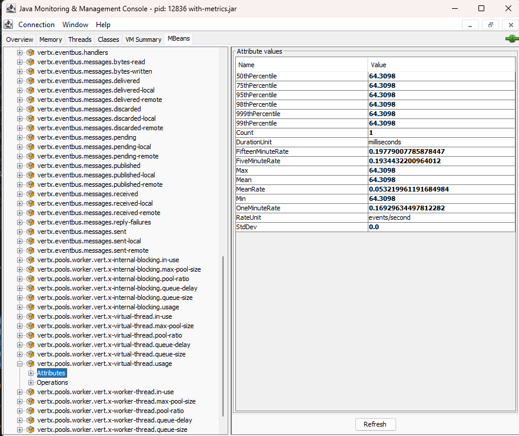
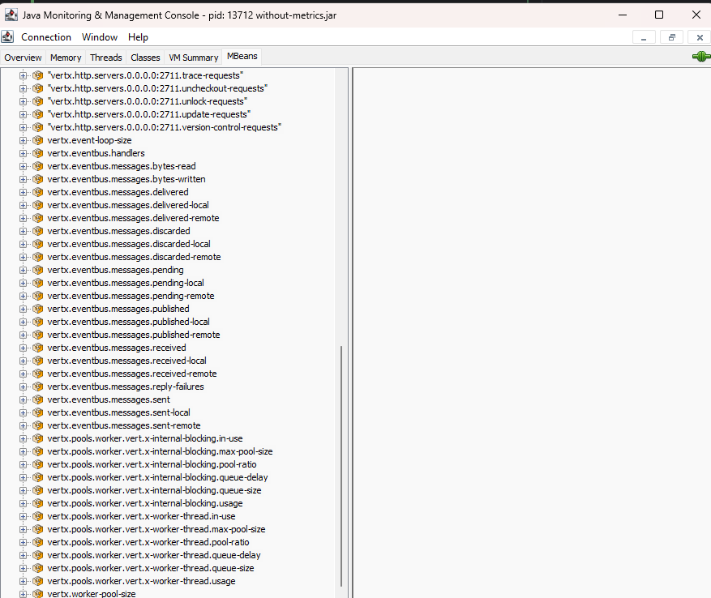

# VirtualThreads-Metrics-VertX

A repo for POC of how https://github.com/eclipse-vertx/vert.x/issues/5661 feature could be added.

Branch with code changes: https://github.com/go2hel/vert.x/tree/feature/virtual-thread-worker-metrics

### Requirements

Java 21+

## How to test?

The jars are stored in the [results](results) folder. 

- You can choose the jar which you want to test and run with following command.

```bash
  java -jar results/with(out)-metrics.jar 
```

- Post running it, to verify the metrics open jconsole.

```bash
  jconsole
```

- Select the jar and go to mbeans tab. Open the folder with name like vertx@ and scroll all the way down to notice the metrics.

## Results

### With Metrics



### Without Metrics


